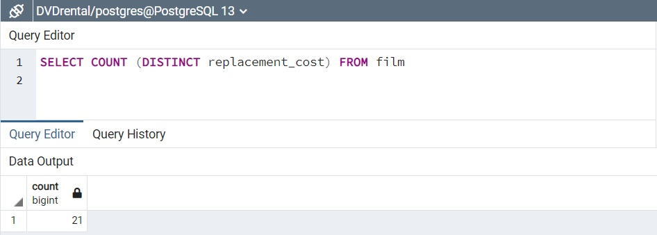
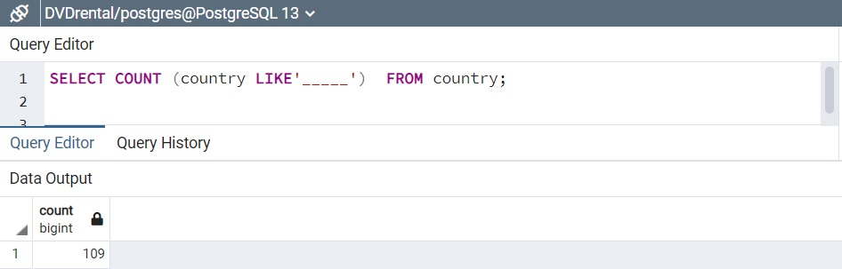

## DISTINCT-COUNT Komut kullanım örenkleri
---

1. film tablosunda bulunan replacement_cost sütununda bulunan birbirinden farklı değerleri sıralayınız.


```SQL
SELECT DISTINCT replacement_cost FROM film;
```

2. film tablosunda bulunan replacement_cost sütununda birbirinden farklı kaç tane veri vardır?



```SQL
SELECT COUNT (DISTINCT replacement_cost) FROM film 

```

3. film tablosunda bulunan film isimlerinde (title) kaç tanesini T karakteri ile başlar ve aynı zamanda rating 'G' ye eşittir?


```SQL
SELECT COUNT (title)  FROM film 
WHERE title LIKE 'T%' AND rating = 'G';
```

4. country tablosunda bulunan ülke isimlerinden (country) kaç tanesi 5 karakterden oluşmaktadır?




```SQL
SELECT COUNT (country LIKE'_____')  FROM country;
```

5. city tablosundaki şehir isimlerinin kaçtanesi 'R' veya r karakteri ile biter?


```SQL
SELECT COUNT (city ILIKE'%r')  FROM city;
```