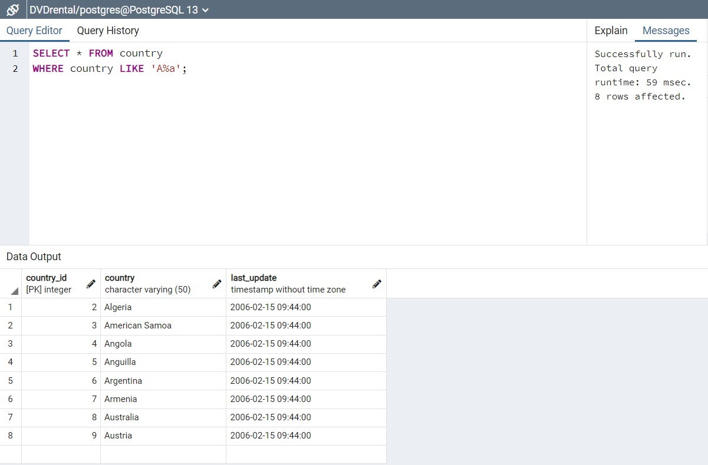
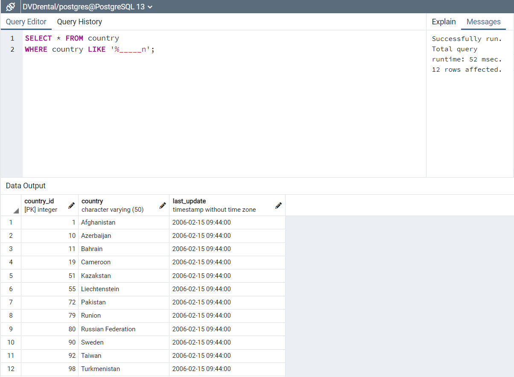
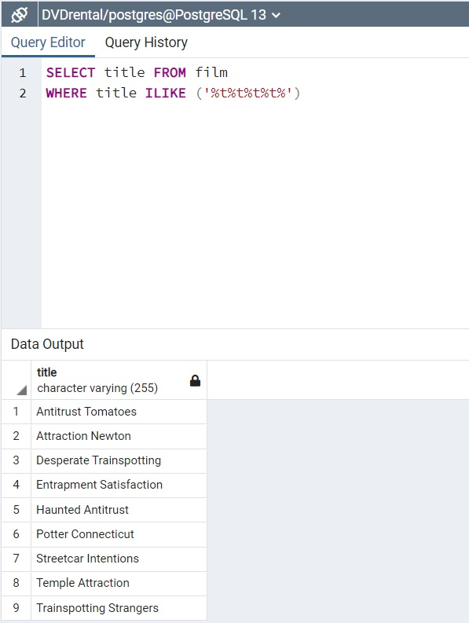
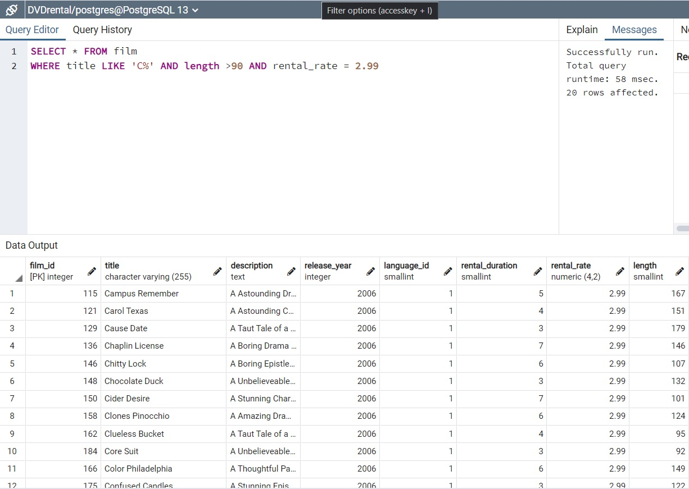

## LIKE-ILIKE Komut kullanım örenkleri
---

1. country tablosunda bulunan country sütunundaki ülke isimlerinden 'A' karakteri ile başlayıp 'a' karakteri ile sonlananları sıralayınız.



```SQL
SELECT * FROM country
WHERE country LIKE 'A%a';

```

2. country tablosunda bulunan country sütunundaki ülke isimlerinden en az 6 karakterden oluşan ve sonu 'n' karakteri ile sonlananları sıralayınız.



```SQL
SELECT * FROM country
WHERE country LIKE '%_____n';
```

3. film tablosunda bulunan title sütunundaki film isimlerinden en az 4 adet büyük ya da küçük harf farketmesizin 'T' karakteri içeren film isimlerini sıralayınız.



```SQL
SELECT title FROM film 
WHERE title ILIKE ('%t%t%t%t%')
```

4. film tablosunda bulunan tüm sütunlardaki verilerden title 'C' karakteri ile başlayan ve uzunluğu (length) 90 dan büyük olan ve rental_rate 2.99 olan verileri sıralayınız.




```SQL
SELECT * FROM film 
WHERE title LIKE 'C%' AND length >90 AND rental_rate = 2.99
```

