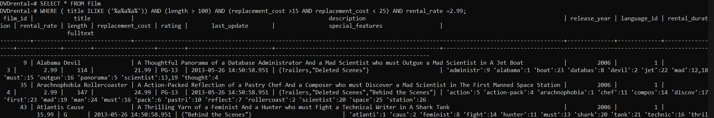

## PSQL Terminal arayüzü kullanımı ve Query örnekleri
----

    PSQL PostgreSQL ile gelen terminal tabanlı bir kullanıcı arayüzüdür. Aşağıda birkaç temel psql komutu gösterilmiştir.

- PSQL ile PostgreSQL'e bağlanmak için;

` psql -U <kullanıcı adı> `

- Bulunan veritabanlarını listelemek için;

` \l veya \list `


- Bu örnek için dvdrental verilerine bağlanmak için;

` \c dvdrental veya \connect dvdrental `

- Bağlanılan veritabanında bulunan tabloları listelemek için;

` \dt `


- Herhangi bir tablonun detaylarını görmek için;

` \d <tablo adı> `


----

### Örnek Sorgu Senaryoları

1. customer tablosunda bulunan first_name değeri  'A' ve last_name değeri 'G' karakteri ile başlayan verileri sıralayınız.


```SQL
SELECT * 
FROM customer
WHERE first_name LIKE 'A%' AND last_name LIKE 'G%';
```

2. film tablosunda bulunan ve uzunluğu 80 ile 120 arasında bulunan ve aynı zamanda rental_rate değeri 0.99 veya 2.99 olan verileri sıralayınız.


```SQL
SELECT * 
FROM film
WHERE (length BETWEEN 80 AND 120) AND (rental_rate IN (0.99, 2.99));
```
3. İlk isminde en az 2 tane 'a' harfi olan, uzunluğu 100 den büyük olan, replacement_cost değeri 15 den büyük 25 den küçük olan ve rental_rate değeri 2.99 olan verileri gösteriniz



```SQL
SELECT *  FROM WHERE ( title ILIKE ('%a%a%a%')) AND (length > 100) AND (replacement_cost >15 AND replacement_cost < 25) AND rental_rate =2.99;
```
